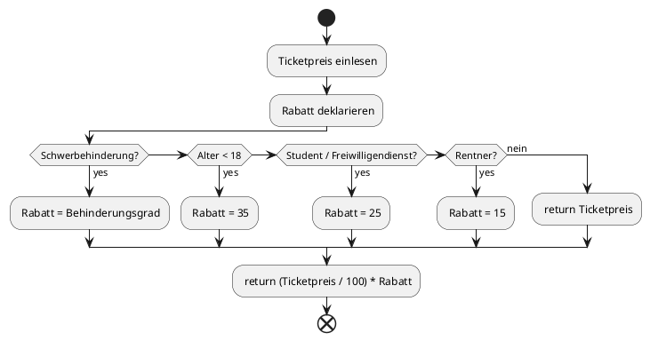

# Tutorial

This tutorial is from the "Zentrums für digitale Barrierefreiheit und Assistive Technologien (ACCESS@KIT)"(Center for Digital Accessibility and Assistive Technologies (ACCESS@KIT))

- [PlantUML Einführung (PDF)](https://www.cooperate-project.de/umlschulung/2_1_PlantUML-Einführung.pdf)

1.  **Class Diagram**: Basic declaration of classes and OOP.
    See also further examples: [classes](../classes/)

2.  **Use Case Diagram**
3.  **Activity Diagram**
    -     Show sequences of actions or decisions.
    - Include start and end points.
    - Use decision nodes, branches, loops, and concurrent activities.
    - Often used in business modeling, software design, and requirements analysis.
      Example:

4. **Sequence Diagram**
5. **Complex Sequence Diagram**
