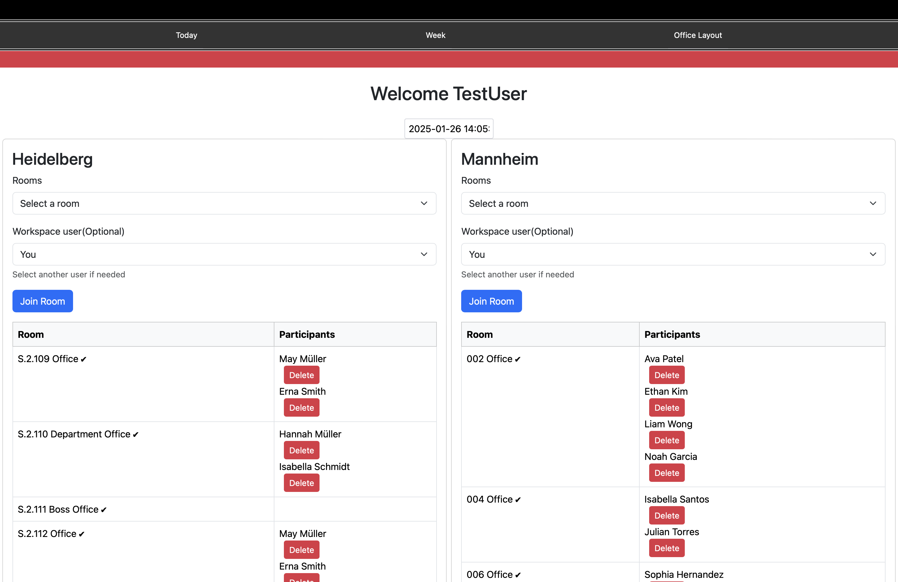

# Examen project Real-Time Room Booking and Occupancy Software via [Samply.Beam](https://github.com/samply/beam)

[examen documentation](./project_doc.pdf)

## Application Design
Overview today for all areas with there rooms and the current bookitn.
booking.

  

---

## GUI Preview

  

    <h3>Real-Time Dashboard</h3>
    

      The dashboard gives an instant overview of room occupancy and bookings across all areas.
      It integrates real-time data from <a href="https://github.com/samply/beam">Samply.Beam</a>
      to ensure that users always have up-to-date information on room availability.
    

    <ul>
      <li>Real-time updates</li>
      <li>Interactive room selection</li>
      <li>Responsive design for mobile and desktop</li>
    </ul>
  

  

    
  

