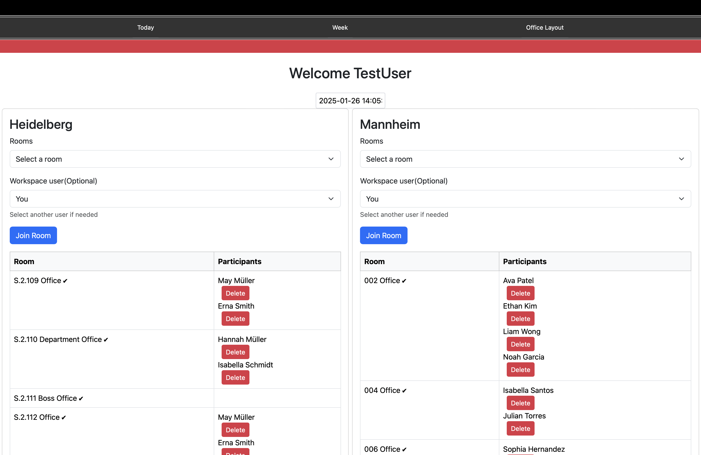
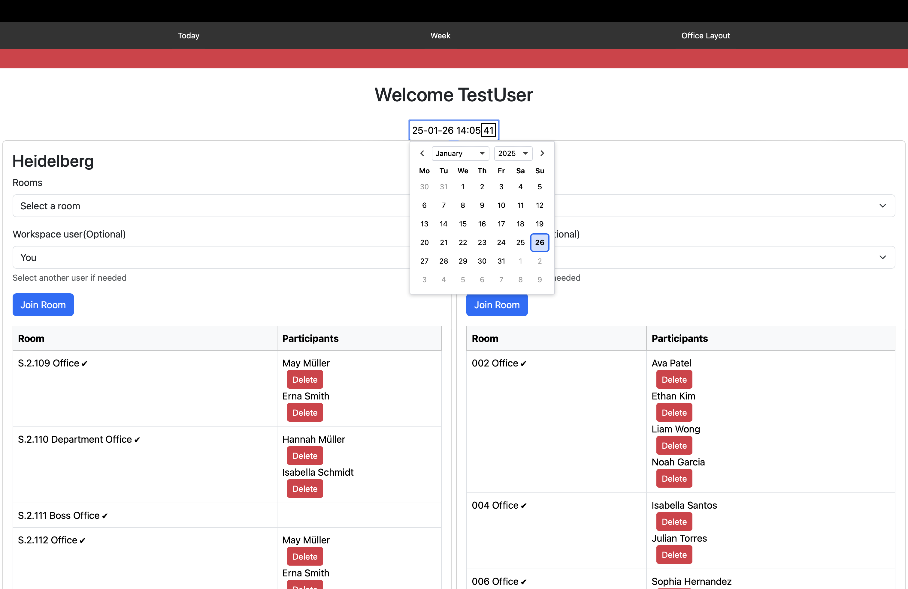
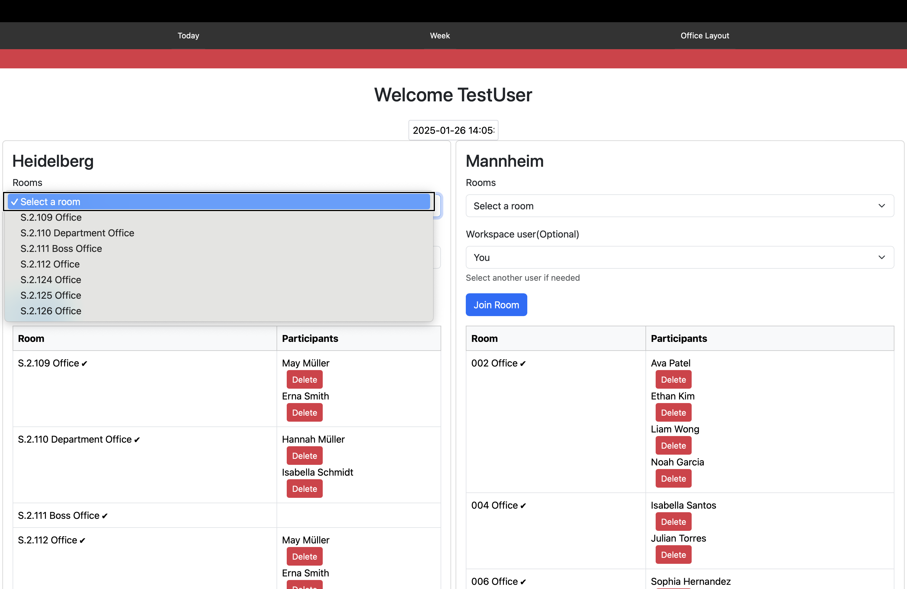
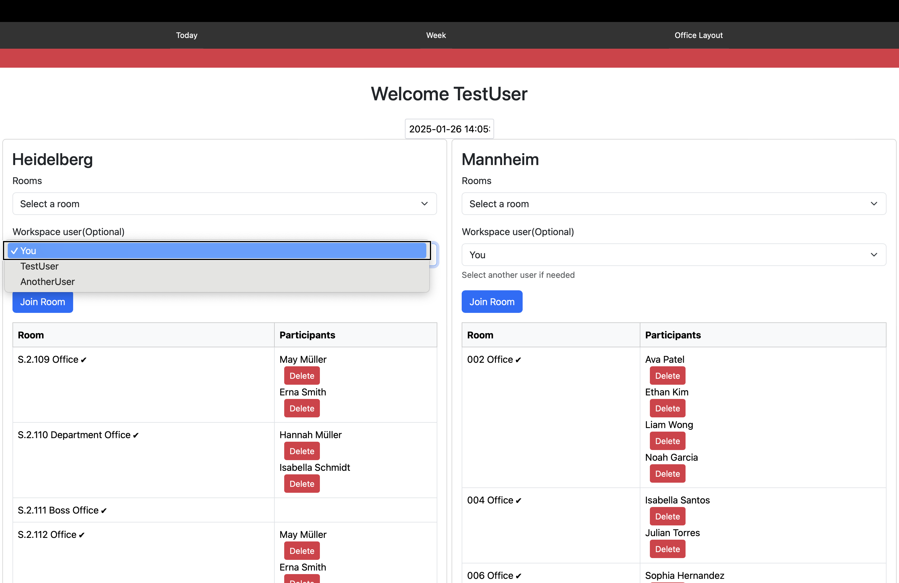
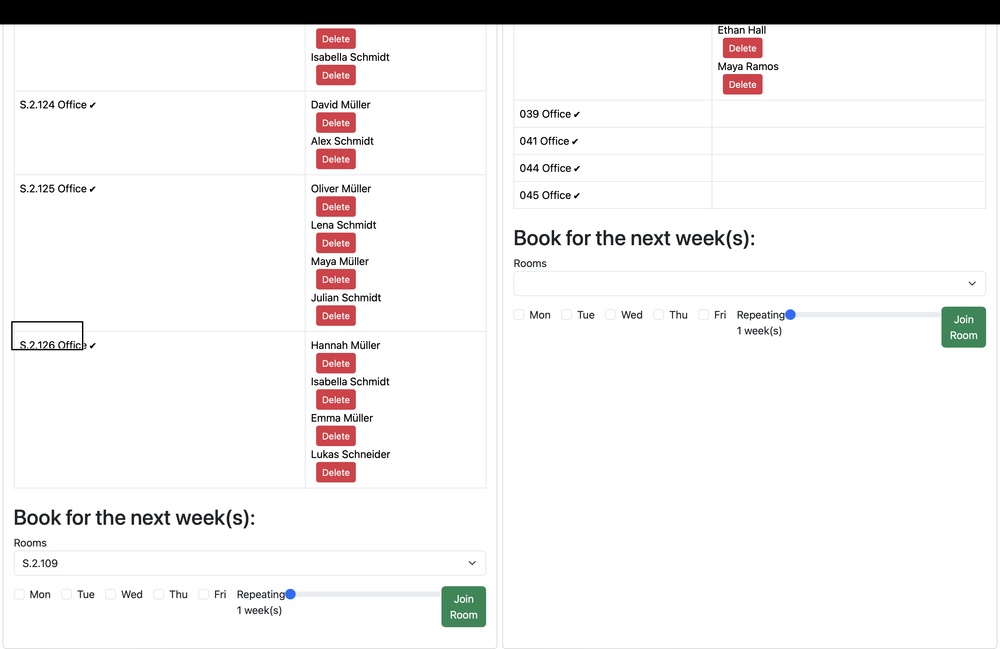
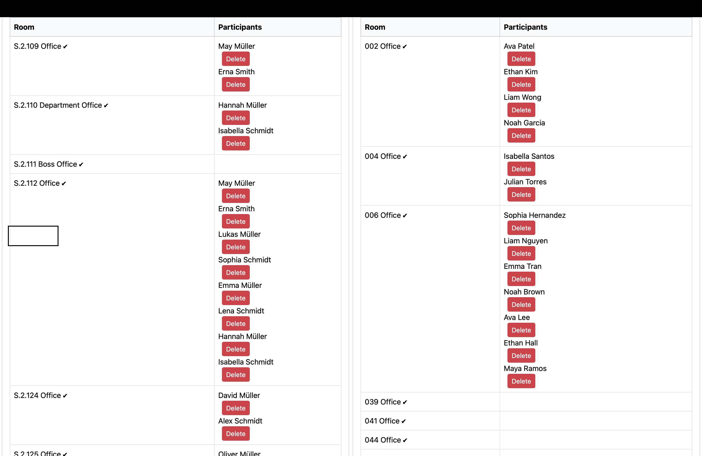

# Examen Project: Real-Time Room Booking and Occupancy Software via [Samply.Beam](https://github.com/samply/beam)

📄 [View Project Documentation](./project_doc.pdf)

---

## GUI Preview

### 🖥️ Real-Time Dashboard

  

    

      The dashboard gives an instant overview of room occupancy and bookings across all areas.
      It integrates real-time data from <a href="https://github.com/samply/beam">Samply.Beam</a>
      to ensure that users always have up-to-date information on room availability.
    

    <ul>
      <li>Real-time updates</li>
      <li>Interactive room selection</li>
      <li>Responsive design for mobile and desktop</li>
    </ul>
  

  

    
  

---

### 📅 Calendar View

  

    

      Navigate through bookings using the interactive calendar. 
      Changes are reflected in real-time when selecting different dates.
    

  

  

    
  

---

### 🏢 Room Selection

  

    

      Easily bookings by selecting rooms from a dropdown menu.
    

  

  

    
  

---

### 👤 User Selection

  

    

      Users can be assigned using a dropdown interface.
    

  

  

    
  

---

### 🗓️ Subscribe Multiple Weeks

  

    

      Users can subscribe to recurring slots over multiple weeks, based on selected weekdays.
    

  

  

    
  

---

### 📊 Room Overview Table

  

    

      A flexible table layout provides an overview of all rooms and their assigned subscribers.
    

  

  

    
  

