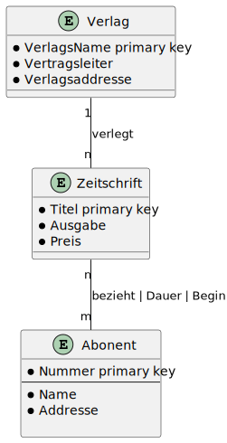

## Übungen zur Datenbankmodellierungen 

Eine Agentur zur Vermittlung von Zeitschriftenabonnements möchte ihre Abonne¬ments mit Hilfe einer Datenbank verwalten. Zu deren Entwicklung wird folgendes ER- Diagramm benutzt.  
@startuml Verlag  
entity Verlag{  
    * VerlagsName primary key  
    * Vertragsleiter  
    * Verlagsaddresse  
}  

entity Zeitschrift {
    * Titel primary key
    * Ausgabe
    * Preis
}
entity Abonent {
    * Nummer primary key 
    --
    * Name
    * Addresse 

}

Verlag "1" -- "n" Zeitschrift : verlegt
Zeitschrift "n" -- "m" Abonent: bezieht | Dauer  | Beginn 
@enduml

